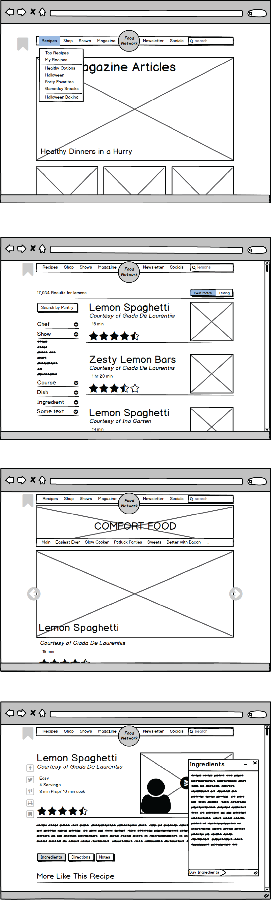
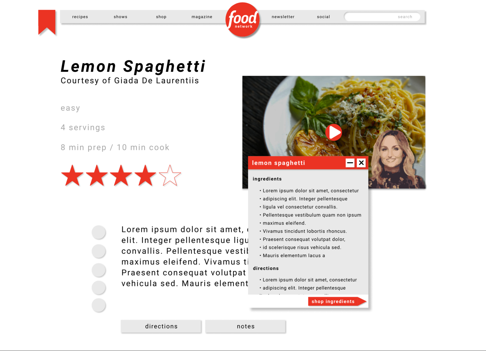

# Background {.page-section}
The Food Network website serves as both a recipe repository, a blog, and a tv schedule for The Food Network TV channel. It's important to support all of these goals in a cohesive design, that caters to users who use all or just one of the features. The original site is pretty cluttered and hard to read intuitively. My goal was to both create a cleaner, more intuitive interface, while also staying loyal to the channel's brand. 

# Analysis {.page-section}
I did some analysis of the original site based on 4 basic metrics. It might be helpful to look around the site for yourself first.
<a href="https://www.foodnetwork.com/">https://www.foodnetwork.com</a>

## Intuitive Design
The area above the menu-bar (in the dark gray box) contains a bunch of random links to different things. These elements don’t abide by a grid, and it’s difficult to parse out what is intereactive and what isn’t.

## Ease of Learning
The original site has a poor heirarchy of actions. Thin columns present a lot of information in a small space with seemingly equal importance and make it hard to discern the discreet sections of the site.

## Efficiency of Use
Often, when searching for a recipe, a user might be given many results for the same dish. Comparing the indgredients and directions of these recipes is not facilitated well. A user must switch back and forth between pages, which can be a pain for experienced users.

## Memorability
There is little consistancy in layout between similar elements. Buttons and links come in all different shapes and sizes and the presentation of articles and recipes is different in the homepage, sidebar, collection page, and search page. Learning how to use one part of the interface doesn’t really allow the user to recall or reuse information about how to interact with similar elements.

# Wireframes {.page-section}

# What's been changed? {.page-section}
## Intuitive Design
I’ve cleaned up the header and moved most of the functionality into dropdown menus. The search bar is now in the menu bar with all the other most important links. Additionally, buttons and interactable bits don’t stand out. I address this with the visual elements of the redesign (color, shadows)

## Ease of Learning
I moved everything into 2 columns, and moved all of the extra links to other pages down to the bottom of the page, as it’s likely they’ll only want to follow a link after they are done scanning the article or recipe. In order highlight the menu bar, I moved the search filters from the top to a side bar.

## Efficiency of Use
Envisioning a single page server-side rendered app, we can create pop-up windows for the directions and ingredients that stick around, even when on a different recipe's page. This allows a super-user to quickly compare results.

## Memorability
I have tried to build the layout with distinct “modules”. So, for example, the layout of the recipe cards in the search function look roughly like the actual recipe pages themselves. And all buttons have similar visual qualities (color, shadow).

# Rebrand {.page-section}

The original interface is cluttered and inconsistant both from a layout and visual design perspective. I used grid of 16th's to lay everything out, with most large groupings of elements (such as the menu bar) aligning to 8th's and smaller elements like the social network links aligning to 16th's. This creates a natural heirarchy that was missing in the original. 

There are more than 7 different colors in the original interfaces color palette, I have reduced that to 4 including black and white. Red is a strong color, so I used it sparingly. It only appears on the logo, and buttons or other interface elements that can be interacted with but don’t make that immediately clear with text. I also used drop shadows to suggest depth and separate elements from each other. This is especially helpful when they share a color. Shadows are also used to suggest things that can be interacted with.

# Conclusion {.page-section}
This project first started to introduce me to iterative design. Working on wireframes, and not worrying about the more visual aspects of the site, allowed me to focus on creating a clear and readable silhouette for the site. It also made programming the styling easier, because I could get the layout done first and have a solid idea of how each element should interact in the final project. The benefit of learning through redesigns is that it allows you to more critically think through design decisions, and to triage the most important aspects of design while not getting bogged down in the content itself.
