# Background {.page-section}
Simmer is a startup featured in Y Combinator's 2019 Demo Day. Their product is Yelp-like site that focuses specifically on allowing users to write and read reviews of specific dishes at a restaurant. Additionally they provide quick, centralized access to multiple delivery platforms, like UberEats and Postmates, straight from the app. With these features and criteria in mind, our group did a blind redesign of the product, focusing on the parts we thought were most essential to the product. 
                        
# Ideation {.page-section}
## Who is affected by the product?
The users deciding what food to order and the users leaving reviews of dishes will be the main groups of people that will be directly impacted by our interface. They are interacting with each other through the app/website and their choices are affected by the experiences and choices made by previous reviewers.

Restaurant managers and employees will be affected by the interface as well, which may influence their number of customers. They may also be motivated to change their menu to optimize for Simmer’s algorithm. 

## Criteria
We determined that these were the main features that we would design for.

* Write a review for a specific dish
* Look at reviews
* Indicate what delivery services are available for selected restaurant

# Mockups {.page-section}
## Wireframe A
The first sketch displays a lot of information clearly in a small space. Users will be able to see price, average review score, and distance from current location all in the card's description. With this information users can better compare results.

    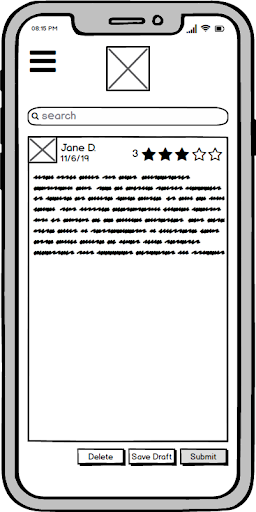
    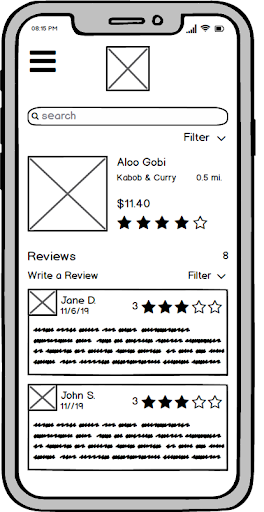
    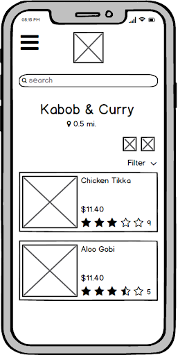
    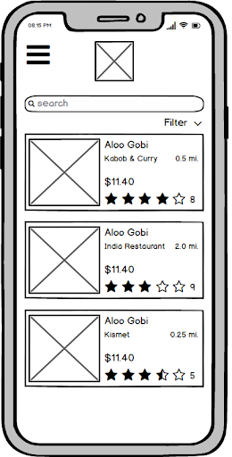

## Wireframe B
This sketch focuses on discoverability, with a dedicated page, and emphasis on images. When comparing dishes, it's easy to fall back on what you know. Here, we tried to emphasize as many different options as possible, and users would choose based on what they find most appetizing.

    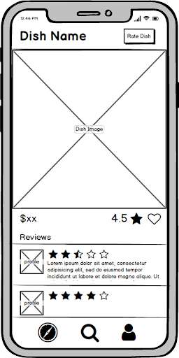
    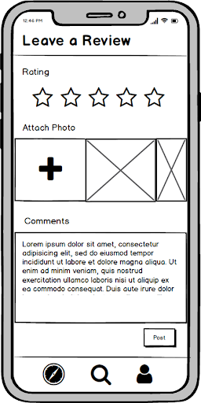
    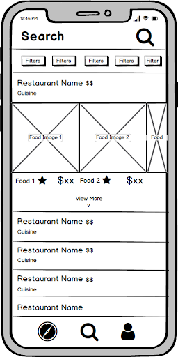
    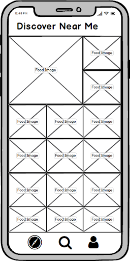

## Wireframe C
This sketch allows you to search by both restaurant and dish. It combines elements of the first two sketches, and also includes a formal landing page for users where they discover new dishes when opening the app.

    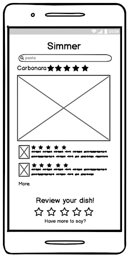
    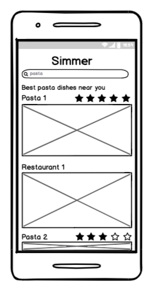
    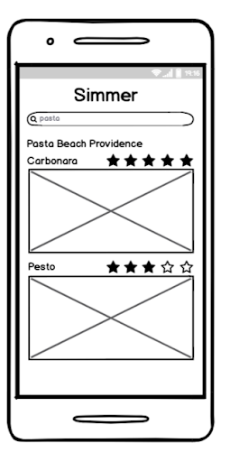
    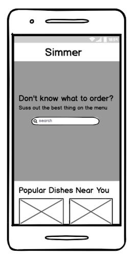

# Design 1 {.page-section}
When iterating on our original lo-fi sketches, we concluded that the most important  tasks to the functionality of this app were the ability to look up dishes without the context of a restaurant, comparing different dishes within a restaurant, and creating a quick way for people to rate dishes (with an option of going further and leaving a review). Since the functionality of the app depends on the user’s willingness to leave a rating and or review, we wanted to end up with a design that made it easy to leave a review. We used the landing page from wireframe C, which had a section for search and a section for discovering new dishes below to encourage exploration. Visually we added The dishes all drop shadows clickable elements to afford interaction. When clicked, the cards expand, keeping the same general layout to increase consistency across views.

    
    
    
    

# Feedback {.page-section}
During a demo session, we walked through our interactive mockup, and then received feedback from a group of our peers. Most of the critiques focused on how to best lay out menus and size our fonts to best make use of space, while also making the interface accessible. These are a few of the comments we received.

* "The nav bar could be mor helpful."
* "Teal is an unappetizing color."
* "Buttons are too small and hard to click for people with impaired motor skills."
* "The hamburger icon suggests made for desktop. Make it so that everything shifts to the right instead of dropdown, or dropdown fullscreen."
* "What affordances make it clear that the background isn’t clickable when the menu is open."

# Design 2 {.page-section}
We iterated on the original design, keeping the critiques in mind, while still trying to stay true to our original goals.
 

    
    
    
    
    
    

# Testing {.page-section}
We gave users a list of tasks to carry out, that would highlight the usability of our interface. We made some hypotheses with quantitative metrics
about how the users would interact with the app to achieve the tasks.

## Tasks
* Use Simmer to find a good curry dish you would buy for lunch, and read some reviews of the dish. Explain why and how you chose the dish.
* After finding the curry dish that you would buy, write a review for it.
* Find the page that lists all of your previous reviews.

## Hypotheses
* We hypothesize that users will first search “Curry” to look for a curry dish from the search bar. They will then select the dish that is both reasonable in cost and rated high.

* We hypothesize that users will not have a difficult time finding the “Write a Review” button as it stands out with its orange color against a plain white background. We hypothesize that the time taken would be 5s

* We hypothesize that users will be able to successfully navigate to their Account to find their personal dish review page as they would know from experience from other apps that features dedicated to themselves are usually found under an “Account” heading. We hypothesize the time taken to be 5-10s

## Results
Users were generally comfortable using the interface. Users had positive things to say about its appearance and layout, saying that it is simple and attractive and they could carry out tasks efficiently. This is also reflected by the metrics, where all users had a 100% completion rate on the tasks, and only one user made an error. This error was instantly noticed and corrected by the user. The "time on task" also fit our hypothesis. Task 1 took a longer time as users were describing their evaluation process for their dishes and as they browsed through the reviews for the dishes. 

# Conclusion {.page-section}
We sent the final draft over to Simmer, and their design team responded with interesting in talking more about our designs. There's still more work to do first though, as we haven't completedd integrating the online user tests into a third iteration of the interface. The iterative design process has allowed us to start with many different ideas, and slowly whittle them away until we have a core feature set that has withstood multiple rounds of testing.

Our tests directly resulted in a more streamlined interface. With feedback from both users and other designers, we were able to pinpoint places of inefficiency and bottlenecks in the design and also get suggestions about how to mitigate these issues. We were able to get a wider variety of user experience levels, instead of only testing CS and UI students by conducting tests online. Through these tests we uncovered issues in accessibility that we hadn't previously considered. We also learned how to more efficiently write and conduct the tests themselves so that the wording and structure minimizes confusion and maximizes the production of usable data results.